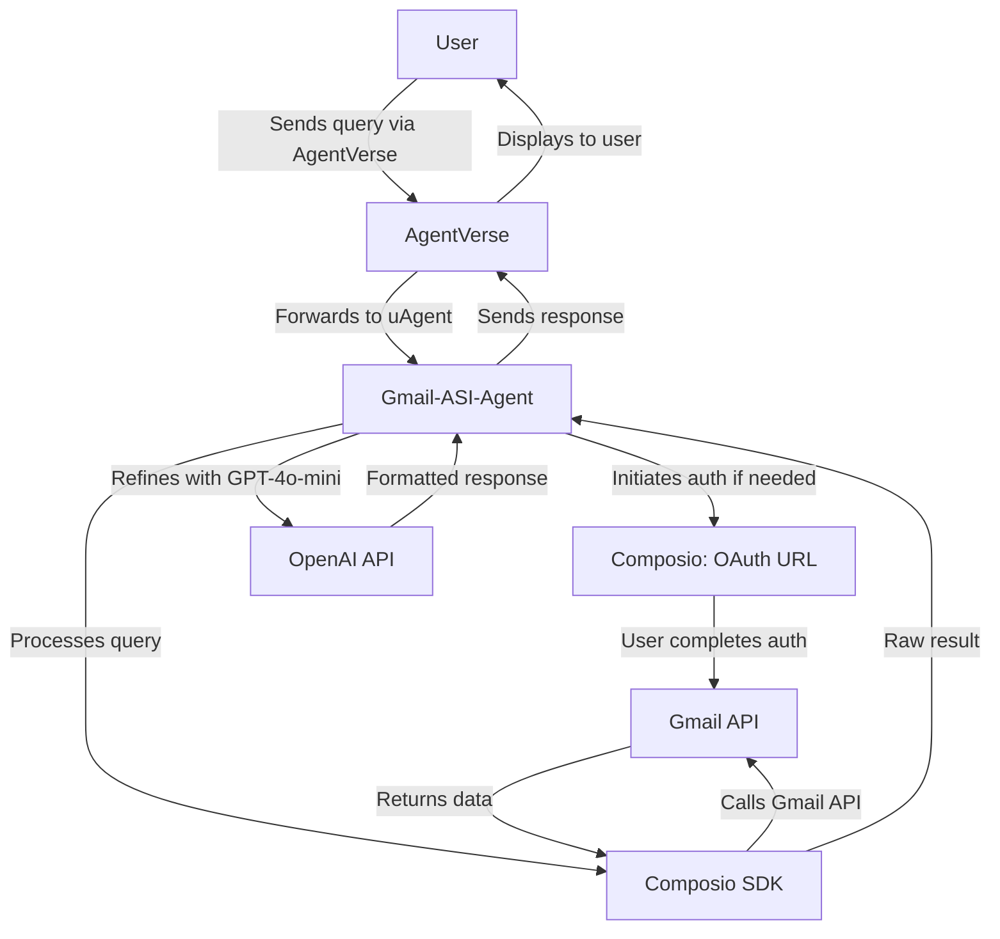

# Gmail-ASI-Agent 🤖

   [](https://x.com/gautammanak02)

Welcome to the **Gmail-ASI-Agent**, an intelligent Gmail assistant powered by the [uAgents framework](https://github.com/fetchai/uAgents), [Composio](https://composio.dev), and OpenAI's GPT-4o-mini. This agent integrates with Gmail via the Composio SDK to perform a wide range of email operations, from reading full email content to managing contacts and handling spam. Deployed on [AgentVerse](https://agentverse.ai), it processes natural language queries with dynamic authentication and delivers user-friendly, GPT-refined responses.

## Features ✨

- **Comprehensive Gmail Integration**: Supports all 28 Gmail tools via Composio:
  - Create, send, and delete email drafts (`GMAIL_CREATE_EMAIL_DRAFT`, `GMAIL_SEND_DRAFT`, `GMAIL_DELETE_DRAFT`)
  - Send and reply to emails (`GMAIL_SEND_EMAIL`, `GMAIL_REPLY_TO_EMAIL`, `GMAIL_REPLY_TO_THREAD`)
  - Read emails with full body content (`GMAIL_FETCH_EMAILS`, `GMAIL_FETCH_MESSAGE_BY_MESSAGE_ID`, `GMAIL_FETCH_MESSAGE_BY_THREAD_ID`)
  - Manage email labels (`GMAIL_ADD_LABEL_TO_EMAIL`, `GMAIL_CREATE_LABEL`, `GMAIL_REMOVE_LABEL`, `GMAIL_MODIFY_THREAD_LABELS`, `GMAIL_PATCH_LABEL`, `GMAIL_LIST_LABELS`)
  - Move emails to trash or delete them (`GMAIL_MOVE_TO_TRASH`, `GMAIL_DELETE_MESSAGE`)
  - Mark emails as read/unread (`GMAIL_MARK_AS_READ`, `GMAIL_MARK_AS_UNREAD`)
  - Search emails and people (`GMAIL_SEARCH_EMAILS`, `GMAIL_SEARCH_PEOPLE`)
  - Manage contacts and profiles (`GMAIL_GET_CONTACTS`, `GMAIL_GET_PEOPLE`, `GMAIL_GET_PROFILE`)
  - Handle email threads and attachments (`GMAIL_LIST_THREADS`, `GMAIL_GET_ATTACHMENT`)
  - Special handling for spam emails (fetch/delete with `is:spam`)

- **Dynamic Authentication**: Users initiate OAuth2 authentication via AgentVerse, receiving a URL to connect their Gmail account securely.
- **Natural Language Processing**: Leverages GPT-4o-mini for intent detection and response refinement, ensuring clear, professional outputs.
- **AgentVerse Integration**: Runs as a uAgent, processing queries from AgentVerse with real-time interaction.

## Workflow Diagram 📊

Below is the workflow of how the Gmail-ASI-Agent processes user queries:



## Setup Instructions 🛠️

1. **Clone the Repository**:
   ```bash
   git clone https://github.com/gautammanak1/gmail-agent.git
   cd gmail-agent
   ```

2. **Install Dependencies**:
   ```bash
   pip install -r requirements.txt
   ```

3. **Set Up Environment Variables**:
   Create a `.env` file in the project root:
   ```env
   OPENAI_API_KEY=your_openai_api_key
   COMPOSIO_API_KEY=
   GMAIL_AUTH_CONFIG_ID=
   ```

4. **Run the Agent**:
   ```bash
   python agent.py
   ```
   The agent starts on port 8001 and logs available commands on successful auth.

5. **Connect via AgentVerse**:
   - Open AgentVerse and connect to the agent using the address from the log
   - The agent will be available at the address shown in the startup logs

## Usage Examples 📬

1. **Authenticate Gmail**:
   - Query: `Authenticate Gmail`
   - Response: Provides a URL to complete OAuth2 authentication.
   - Follow-up: Send `Auth complete` or another query after authenticating.

2. **Read Emails with Full Content**:
   - Query: `Read emails from google-maps-noreply@google.com`
   - Response:
     ```
     📧 Found 2 email(s):
     ============================================================
     
     📨 Email #1
     📋 Subject: Your Google Maps Update
     👤 From: google-maps-noreply@google.com
     📅 Date: 2025-08-27 10:00
     📝 Full Content: Your recent activity on Google Maps includes...
     ----------------------------------------
     
     📨 Email #2
     📋 Subject: New Feature Alert
     👤 From: google-maps-noreply@google.com
     📅 Date: 2025-08-26 14:30
     📝 Full Content: Introducing our new navigation feature...
     ----------------------------------------
     ```

3. **Move Emails to Trash**:
   - Query: `Move emails from google-maps-noreply@google.com to trash`
   - Response:
     ```
     ✅ Operation completed successfully
     ```

4. **List Contacts**:
   - Query: `List my contacts`
   - Response:
     ```
     👥 Found 3 contact(s):
     =======================================
     
     👤 Contact #1
     📛 Name: John Doe
     📧 Email: john@example.com
     ------------------------------
     
     👤 Contact #2
     📛 Name: Jane Smith
     📧 Email: jane@example.com
     ------------------------------
     
     👤 Contact #3
     📛 Name: Alice Brown
     📧 Email: alice@example.com
     ------------------------------
     ```

5. **Handle Spam Emails**:
   - Query: `Fetch spam mail`
     - Response:
       ```
       📧 Found 2 email(s):
       ============================================================
       
       📨 Email #1
       📋 Subject: Offer!
       👤 From: spam@example.com
       📅 Date: 2025-08-27
       📝 Full Content: Limited time offer...
       ----------------------------------------
       
       📨 Email #2
       📋 Subject: Discount Now
       👤 From: deals@example.com
       📅 Date: 2025-08-26
       📝 Full Content: Special discount...
       ----------------------------------------
       ```
   - Query: `Delete spam mail`
     - Response:
       ```
       ✅ Operation completed successfully
       ```

6. **Mark Emails as Read/Unread**:
   - Query: `Mark emails from john@example.com as read`
     - Response:
       ```
       ✅ Operation completed successfully
       ```

## Query Examples 🎯

### **Search & Read Emails**
```
"Read emails from google-maps-noreply@google.com"
"Search emails from john@example.com"
"Find emails about 'meeting'"
"Fetch spam mail"
"Read recent emails"
```

### **Send & Compose Emails**
```
"Send email to john@example.com"
"Send email to john@example.com about meeting tomorrow"
"Send email to team@company.com with subject 'Weekly Update'"
```

### **Delete & Manage Emails**
```
"Delete emails from spam@domain.com"
"Move emails from john@example.com to trash"
"Delete spam emails"
```

### **Label Management**
```
"Create label 'Important'"
"Add label 'Important' to emails from boss@company.com"
"Remove label 'Spam' from emails from john@example.com"
```

### **Contact Management**
```
"List my contacts"
"Show all contacts"
"Get my contact list"
```

### **Email Status Management**
```
"Mark emails from john@example.com as read"
"Mark important emails as unread"
"Show my Gmail profile"
```

## Advanced Usage Scenarios 🚀

### **Bulk Email Operations**
The agent can handle multiple emails simultaneously:
- **Batch Deletion**: Delete all emails from a specific sender
- **Mass Labeling**: Apply labels to multiple emails at once
- **Bulk Status Updates**: Mark multiple emails as read/unread

### **Smart Email Filtering**
Advanced search capabilities include:
- **Date Ranges**: Find emails from specific time periods
- **Content Analysis**: Search within email body content
- **Sender Patterns**: Identify and manage emails from specific domains

### **Contact Organization**
Comprehensive contact management:
- **Contact Search**: Find contacts by name or email
- **Contact Details**: Access full contact information
- **Contact Groups**: Organize contacts for better management

### **Email Thread Management**
Handle complex email conversations:
- **Thread Tracking**: Follow email conversations
- **Reply Management**: Handle replies within threads
- **Thread Organization**: Apply labels and status to entire threads

## Technical Architecture 🏗️

### **Core Components**
- **uAgents Framework**: Provides the agent infrastructure and communication protocols
- **Composio SDK**: Handles Gmail API integration and authentication
- **OpenAI GPT-4o-mini**: Powers natural language understanding and response generation
- **AgentVerse Integration**: Enables seamless user interaction through the platform

### **Authentication Flow**
1. **Initial Request**: User sends authentication request via AgentVerse
2. **OAuth Initiation**: Agent generates OAuth2 URL through Composio
3. **User Authorization**: User completes authentication in browser
4. **Token Management**: Agent receives and manages access tokens
5. **Session Establishment**: Secure connection established for Gmail operations

### **Query Processing Pipeline**
1. **Intent Recognition**: GPT-4o-mini analyzes user query for intent
2. **Parameter Extraction**: Relevant parameters identified and extracted
3. **Tool Selection**: Appropriate Gmail tool selected based on intent
4. **API Execution**: Composio SDK executes the selected operation
5. **Response Formatting**: Raw results refined and formatted by GPT-4o-mini
6. **User Delivery**: Formatted response sent back through AgentVerse

## Performance & Reliability 📈

### **Response Time Optimization**
- **Caching**: Frequently accessed data cached for faster responses
- **Async Processing**: Non-blocking operations for better user experience
- **Batch Operations**: Efficient handling of multiple email operations

### **Error Handling & Recovery**
- **Graceful Degradation**: Continues operation even with partial failures
- **Retry Mechanisms**: Automatic retry for transient failures
- **User Feedback**: Clear error messages and recovery suggestions

### **Security & Privacy**
- **OAuth2 Authentication**: Secure, industry-standard authentication
- **Token Management**: Secure storage and rotation of access tokens
- **Data Privacy**: No email content stored or logged unnecessarily

## Integration Capabilities 🔗

### **AgentVerse Platform**
- **Real-time Communication**: Instant query processing and response
- **Multi-user Support**: Handles multiple users simultaneously
- **Session Management**: Maintains user context across interactions

### **Gmail API Features**
- **Full API Coverage**: Access to all Gmail API capabilities
- **Real-time Updates**: Immediate reflection of changes in Gmail
- **Cross-platform Sync**: Changes sync across all Gmail clients

### **Extensibility**
- **Plugin Architecture**: Easy addition of new email tools
- **Custom Workflows**: Support for user-defined automation
- **API Integration**: Potential for integration with other services

## Troubleshooting 🐞

### **Authentication Issues**
- **OAuth Flow Problems**: Ensure complete browser authentication
- **Token Expiration**: Re-authenticate if tokens become invalid
- **Permission Issues**: Verify Gmail account permissions

### **Query Failures**
- **Email Not Found**: Verify sender email exists and has emails
- **Permission Denied**: Check Gmail account access permissions
- **API Limits**: Respect Gmail API rate limits

### **AgentVerse Connection Issues**
- **Port Conflicts**: Ensure port 8001 is available
- **Network Issues**: Check firewall and network configuration
- **Agent Registration**: Verify proper agent registration in AgentVerse

### **Performance Issues**
- **Slow Responses**: Check OpenAI API response times
- **Memory Usage**: Monitor agent memory consumption
- **Network Latency**: Consider server location optimization

## Best Practices 💡

### **Query Formulation**
- **Be Specific**: Provide clear, detailed instructions
- **Use Natural Language**: Write queries as you would speak them
- **Include Context**: Mention relevant details for better results

### **Email Management**
- **Regular Cleanup**: Use the agent for routine inbox maintenance
- **Label Organization**: Implement consistent labeling strategies
- **Contact Maintenance**: Keep contact lists updated and organized

### **Security Considerations**
- **Regular Re-authentication**: Periodically refresh OAuth tokens
- **Permission Review**: Regularly review Gmail app permissions
- **Secure Communication**: Use secure channels for sensitive operations

## Future Enhancements 🔮

### **Planned Features**
- **Email Templates**: Pre-defined email templates for common use cases
- **Automated Workflows**: Rule-based email processing and organization
- **Analytics Dashboard**: Email usage statistics and insights
- **Multi-language Support**: Support for multiple languages

### **Integration Roadmap**
- **Calendar Integration**: Email-to-calendar event creation
- **Task Management**: Convert emails to actionable tasks
- **Document Processing**: Handle email attachments and documents
- **Team Collaboration**: Multi-user email management features

## Contributing 🤝

Contributions are welcome! Please:
1. Fork the repository
2. Create a feature branch (`git checkout -b feature/YourFeature`)
3. Commit changes (`git commit -m 'Add YourFeature'`)
4. Push to the branch (`git push origin feature/YourFeature`)
5. Open a pull request

### **Development Guidelines**
- **Code Quality**: Follow Python best practices and PEP 8
- **Testing**: Include tests for new features
- **Documentation**: Update documentation for any changes
- **Security**: Ensure security best practices are followed

## License 📜

This project is licensed under the MIT License. See the [LICENSE](LICENSE) file for details.

## Contact 📧

For questions, reach out to Gautam Kumar at [gautam.kumar@fetch.ai](mailto:gautam.kumar@fetch.ai) or open an issue on GitHub.

## Acknowledgments 🙏

- **Fetch.ai Team**: For the uAgents framework and continuous support
- **Composio**: For the excellent Gmail integration capabilities
- **AgentVerse**: For the innovative agent deployment platform
- **Open Source Community**: For the tools and libraries that make this possible

---

Built with ❤️ for seamless Gmail automation!
